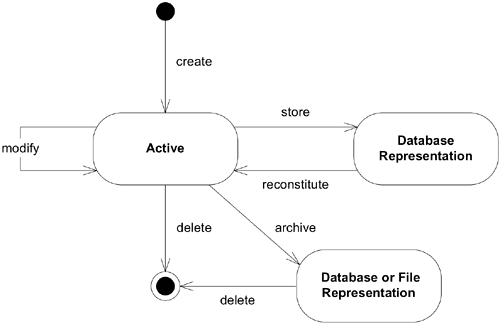
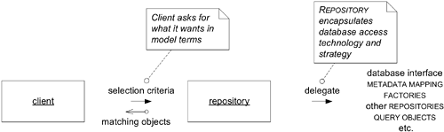
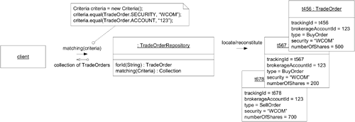
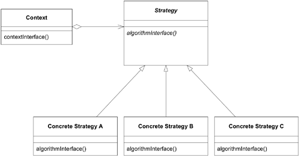

- [A C# and dotnet Software Development Kit for the Domain-Driven Design concepts](#a-c-and-dotnet-software-development-kit-for-the-domain-driven-design-concepts)
- [Background](#background)
  - [Some very important things you should know before you start](#some-very-important-things-you-should-know-before-you-start)
- [The Domain-Driven Design Core Concepts](#the-domain-driven-design-core-concepts)
  - [Ubiquitous Language](#ubiquitous-language)
  - [Entities](#entities)
  - [Value Objects](#value-objects)
  - [Domain Services](#domain-services)
  - [The Domain Object Life Cycle](#the-domain-object-life-cycle)
  - [Aggregates and Aggregate Roots](#aggregates-and-aggregate-roots)
  - [Factories](#factories)
  - [Repositories](#repositories)
- [The Domain-Driven Design Model Integrity Concepts](#the-domain-driven-design-model-integrity-concepts)
  - [Bounded Contexts](#bounded-contexts)
  - [Continuous Integration (Not CI/CD framework)](#continuous-integration-not-cicd-framework)
  - [Context Mapping (The infamous mappers)](#context-mapping-the-infamous-mappers)
  - [Shared Kernel](#shared-kernel)
  - [Anticorruption Layer](#anticorruption-layer)
  - [Transformations](#transformations)
- [Extending the toolbox - More Patterns](#extending-the-toolbox---more-patterns)
  - [Specification](#specification)
    - [Specification + Repository Patterns](#specification--repository-patterns)
  - [Strategy Design Pattern](#strategy-design-pattern)
  - [Composite](#composite)
  - [CQRS (Command and Query Responsibility Segregation)](#cqrs-command-and-query-responsibility-segregation)
  - [Mediator Design Pattern](#mediator-design-pattern)
  - [Notification Pattern](#notification-pattern)
- [Acknowledgement](#acknowledgement)
- [How to use this SDK](#how-to-use-this-sdk)
  - [Installation](#installation)
  - [Dependency Injection](#dependency-injection)
- [API Documentation](#api-documentation)
- [Examples](#examples)

# A C# and dotnet Software Development Kit for the Domain-Driven Design concepts

> *"Domain-Driven Design is an approach to software development that centers the development on programming a domain model that has a rich understanding of the processes and rules of a domain. The name comes from a 2003 book by Eric Evans that describes the approach through a catalog of patterns. Since then a community of practitioners have further developed the ideas, spawning various other books and training courses. The approach is particularly suited to complex domains, where a lot of often-messy logic needs to be organized. (...)"*
>
> [Domain Driven Design](https://martinfowler.com/bliki/DomainDrivenDesign.html), Martin Fowler, April 2020

The Domain-Driven Design, also known as *DDD*, is well known in the developer's community because its a good strategy to solve complex business problems in a very particular and structured way.

Its concepts and strategy proposals are present since 2003, when Eric Evans published the book *[Domain-Driven Design: Tackling Complexity in the Heart of Software](https://www.amazon.com.br/Domain-Driven-Design-Tackling-Complexity-Software/dp/0321125215)*.

If you haven't read the book yet, I strongly recommend you to do so. It not only will give you precious information, but also will open your eyes to a new world of possibilities you are probably missing inside your current implementation details while creating software solutions.

**All the concepts implemented in this SDK was inspired by this book**. This project goal is to provide a standard and practical way of reusing this concepts as implementation building blocks for any application made with dotnet and C#, no matter the type they could be or the purpose they should have.

# Background

I've been using and improving my understanding and knowledge about the DDD concepts over the years using C# and dotnet. 

As a developer, I'm far from having a perfect implementation model of the very complex vision the book proposes in each one of its theories. Anyway, this SDK have the intention to achieve a solid and stable code, enriched with the experience I had in various projects using DDD, C# and dotnet in the past.

One of my biggest frustrations when using Domain-Driven Design was, everytime I started working in a new project in a new company or in a new team, I always end up needing to create all the basic framework of DDD over and over again, from time to time, from solution to solution. Sometimes, we can't just reuse code between projects, teams or companies, for any reason that happens to occurs.

Besides DDD being well known over the past 20 years, until today, I found a good number of developers and teams that had some critical gaps of the fundamentals and some big misunderstanding of the concepts Eric Evans proposes in his book.

Over time, I have experienced these gaps and misunderstandings that cause, at the very least, failed implementations, faulty features, misleading results, correct implementations in the wrong places, high coupling, high dependency, business model fuzziness, many, many bugs and refactorings until reaching some really successful results.

For these and other minor reasons, this SDK project aims to provide a full range of abstractions and concrete implementations of existing Domain-Driven Design concepts as an independent Nuget package, built with C# and the dotnet framework.

With this SDK, you (and I) can reuse the same implementations without having to recreating and test everything we need every time.

Additionally, this SDK will provide some extended implementations using design patterns that can help you address specific scenarios and business problems within your application when you choose to follow the domain model design path to develop your solutions.

Finally, I aim to give Domain-Driven Design concepts the attention and time they deserve, to give developers the more complete abstractions they deserve too.

## Some very important things you should know before you start

The concepts of the Domain-Driven Design are not easy to understand at first glance, nor they are easy to digest on first reading, reflecting as results of the first implementations you are going to create.

I would like to advice you not to give up trying to understand and acquire knowledge until you succeed, both from the theory and from the implementation details perspective. 

**You WILL fail a lot before master the concepts, and you will fail a lot before getting used to the implementation details about the Domain-Driven Design concepts.**

The documentation content you will find here is not for the developers who like *bite-sized content*, that you can acquire in just a few minutes, like the development-related content we can see a lot out there. Today, I believe that many developers have lost their sense of persistence and consistence when trying to learn new things. Nowadays, developers tend to think that if they can't learn something in 30 minutes, then it's not worth their time.

I don't expect you to understand this entire package at once, and I don't expect you to use this package to its full potential in your first few implementations.

In any case, the information you will find here is precious, carefully selected and prepared from various sources, giving you the possibility to really understand the entire scope of the concepts that Eric Evans brought us with his book.

Perhaps this work may seem like an academic presentation, rather than a software development showcase as an SDK, but even so, I truly believe this is the best way you can understand those things and put the pieces together by yourself, if you have patience, persistence, willingness to learn and dedicate the time to putting your knowledge into practice in daily development activities.

Once, I was in a place where I didn't know anything about DDD, when working with DDD was a pain. It was very difficult, and the company's business decisions didn't help me improve, but rather, sometimes put me in a position that I was forced to bend the concepts into wrong implementations, because they had neither the time nor the desire to do *the right thing*, according to the literature and the technical decisions.

You should know that Domain-Driven Design is not suitable for all projects and does not solve all problems with your software, and if used incorrectly, it can harm the project more than help it achieve success. Additionally, the Domain-Driven Design will require you to sharp your hard development skills related to C# and dotnet, so maybe you find DDD is not for you (yet), because you lack some technical knowledge.

I will give you my personal (not completed) list of the advantages (pros) and drawbacks (cons) of using DDD inside your project, that I have been able to observe over time:

- **Advantages**
  - It will strengthen and improve team communication with the use of a ubiquitous language, which creates a universal form of communication, reducing misunderstandings throughout the project development;
  - It will use design patterns and principles that really solves the business problems as a very solid and simplified software solution;
  - Domain-Model centric solutions helps to create clear code (that tells a story) and segregates the whole system by responsibilities instead of spliting the system by technical decisions or limitations;
  - It will give you a perfect strategy when you have a system where the business rules (the domain itself) are expected to change frequently over time, where the business logic is complex and convoluted, so you need to change your system behaviors in a controlled manner;
  - It will helps to decouple your application dependencies, facilitating not only the development and tests, but also, helping you make architectural decisions related to the selected tools and technologies, ultimately helping you plan and deliver your systems into real world scenarios;
  - It will help the developers to become more flexible and have a better understanding of the business they are dealing with;
  - It will sharp the developers ability to abstract things other than object-oriented programming;
  - It will let you better test your applications, since the components and layers are more isolated and have less hard-dependencies;
  - It will force the developers to DRY (Don't Repeat Yourself)
  - It will force the developers to use the SOLID principles naturally;
  - It will force your systems architecture to be modular;
  - It will force your developers to get rid of their primitive data type obsession;
  - It will give you all the system flexibility you never imagined you could have;
  - It will let you focus more on the user and on the business rather than technical details about your systems;
  - It will allows you to make changes and apply them more easily, more frequently and in a centralized way;
  - It will give you the oportunity to easily track and trace problems, bugs and errors in your systems;
  - It is architectural project agnostic, where it can be used in various architectural designs, such as microservices, monoliths, web, mobile, desktop applications or even introduced into legacy systems subject to the creation of new functionalities;
  - It will improve your developer teams technical hard skills on their languages, tools, technologies and platforms they are using to create the software solutions;
  - It will make you suffer a lot along the way, but it will bring excelent results to the business, and also in the end, will make you a better developer.
  - Finally, it will help the project to succeed by a large margin if used correctly according to the DDD rules, strategy and concepts;
- **Drawbacks**
  - It requires a open and disciplined mindset, so it is not for every company, it is not for all developer teams;
  - It is not suitable for simple projects, more simplistic or even static business logic due its lack of technical complexity;
  - It will force the project development to be business-centric instead of technological-centric;
  - It will not work with teams and project frameworks that do not encourage (or force) communication;
  - It is time-consuming and requires robust domain and bussiness expertise;
  - It relies on constant and consistent iterations in communicating business needs and implementation details;
  - It is hard to understand at first, outside of the basic software development concepts;
  - It imposes a greater learning curve for developers and business specialists who have no knowledge of domain modeling strategy, its rules and its concepts;
  - It will required more knowledge from the developers regarding to the tools and technologies they use, or those that the company requires to use;
  - It will challenge the developers to come up with some creative solutions due to technical limitations in their tools and platforms as they need to drive development by domain model concepts;
  - It will force your developer teams to become agnostic about information persistence, related to databases and data layers;
  - It will force developers to think more and think outside the box, rather than just creating code;
  - It will slow down the development at first, but will allow for faster changes in the future;
  - It will force the managers to deal more with communication problems than with business problems;
  - It will force some changes in the mindset of developer teams;
  - It will require your developer teams to be able to deal with conflicts between software development concepts they have held for years and will now be challenged to change;
  - It will show you that OOP maybe become your enemy instead of helping you, when trying to implement some of the concepts of DDD, based on the language and technology of your choice;
  - Discovering what should be an Entity and what should be a Value Object can be challenging and sometimes confusing, even for the experienced developers;
  - Finally, it will help the project to fail by a large margin if used incorrectly in relation to the DDD rules, strategy and concepts;

It's up to you to decide whether DDD is the right choice for your project. DDD sometimes becomes boring, and even with experience, it can be complicated.

Remember this very clearly: Domain-Driven Design is a proposition, a strategy, not a design pattern guideline, nor a magic wand that will make your systems perfect and smooth.

But if you choose to use DDD, you are very welcome to the world where everything looks beautiful, but if you don't follow the model-oriented mentality instead of delving too much into the technical side, everything will get ugly very quickly.

I wish you success learning or improving your Domain-Driven Design skills, which will be reflected in your C# hard skills when applying it.

I'm sure it may take some time, but the results are worth the time and the effort.

Be patience, be persistent, be curious, and remember: experience and success comes with trial and error. You only fail if you give up.

I wish you a good learning journey!

# The Domain-Driven Design Core Concepts

The Domain-Driven Design strategy is composed by a series of concepts, patterns and good pratices. 

The main goal of Domain-Driven Design is to create a model (representation) that accurately reflects the domain and its associated business rules, which can then be used to drive the design and implementation of the software.

To achieve this, the book provides us a huge number of constraints and careful definitions that should be followed to create a successful domain model design solution.

In the book, the author uses Java to create some examples of the implementations as real and fictitious scenarios to demonstrate the usage of the concepts explained along the chapters. When using C# to create this implementations, we have a lot of tools and powerful ways on how to implement all the DDD concepts using dotnet.

But before that, is very important you notice you should know and master **all the basic concepts** of the domain-driven design before jumping into the code. 

The next sections, I will give you an overview of the basic concepts without getting too much into the details. This content should be enough for you to get all the things right, and have a good grasp of what the concepts of the Domain-Driven Design are all about.

Enough introductions, let's dive into it!

## Ubiquitous Language

I like to call this concept as the *final desired common language everyone in the project should know and must use*.

We use language and words to create and maintain a communication between developers and business experts, so we can have a good understanting of the subjects and topics being discussed in a conversation. And for this to happen with some degree of success, we need a common way of talking, something that looks like an verbal (literally) agreement of understanding and meaning of the words, and terms we are going to use throught the whole project.

The **ubiquitous language** is introduced in the book on chapter 2, with a simple glimpse:

> *"To create a supple, knowledge-rich design calls for a versatile, shared team language, and a lively experimentation with language that seldom happens on software projects. (...)"*
> 

In a simple way, we must understand the ubiquitous language as a common language shared by both domain experts and developers, which is used to define the model and communicate about the domain. 

This language should be based on the terms and concepts of the domain, and should be used consistently throughout the project.

For the SDK, the ubiquitous language is always present when we choose to use some common verbs, nouns, noun phrases for classes, methods, interfaces, services and other general components of the code structure, bringing meaning to this structures and pieces of code.

## Entities

When we think about an entity model, we must think them as *the core and the heart of the domain model design*.

The entities (a.k.a Reference Objects) are presented in the book on chapter 5, with a very clear concept about *Entities* as *reference objects*:

> *"Many objects are not fundamentally defined by their attributes, but rather by a thread of continuity and identity. (...)"*
> 
> *"Some objects are not defined primarily by their attributes. They represent a thread of identity that runs through time and often across distinct representations. Sometimes such an object must be matched with another object even though attributes differ. An object must be distinguished from other objects even though they might have the same attributes. Mistaken identity can lead to data corruption." (...)*
> 

And finally, Eric Evans describes the exact definition of what an **Entity** is:

> *"An object defined primarily by its identity is called an ENTITY. ENTITIES have special modeling and design considerations. They have life cycles that can radically change their form  and content, but a thread of continuity must be maintained. Their identities must be defined so  that they can be effectively tracked. Their class definitions, responsibilities, attributes, and associations should revolve around who they are, rather than the particular attributes they carry. Even for ENTITIES that don't transform so radically or have such complicated life cycles, placing them in the semantic category leads to more lucid models and more robust implementations. " (...)*
>
> *"When an object is distinguished by its identity, rather than its attributes, make this primary to its definition in the model. Keep the class definition simple and focused on life cycle continuity and identity. Define a means of distinguishing each object regardless of its form or history. Be alert to requirements that call for matching objects by attributes. Define an operation that is guaranteed to produce a unique result for each object, possibly by attaching a symbol that is guaranteed unique. This means of identification may come from the outside, or it may be an arbitrary identifier created by and for the system, but it must correspond to the identity distinctions in the model. The model must define what it means to be the same thing." (...)*
> 

So, these are the key characteristics of an Entity:
- They are UNIQUE ***(required)***
- They have a UNIQUE identity ***(required)***
- They are MUTABLE ***(required)***
- They have a life cycle and a history ***(required)***
- They have attributes ***(required)***
- They have behaviors ***(required)***
- They have validation constraints ***(required)***
- They can have relations ***(optional)***
- They reinforce usage of constraints and validations by creational and structural patterns ***(required)***
- They can have diferent representations of the same identity ***(optional)***
- They can transform through its life cycle , but holds the same identity ***(optional)***
- They cannot be replaced by equivalent instances because they are unique ***(required)***

## Value Objects

For very system we have values, their meaning and their definitions. For this reason, I like to think the value objects as *a way of describing things*.

Value objects are introduced in the book on chapter 5, when Eric Evans says:

> *"Many objects have no conceptual identity. These objects describe some characteristic of a  thing." (...)*
>
> *"However, if we think of this category of object as just the absence of identity, we haven't added much to our toolbox or vocabulary. In fact, these objects have characteristics of their own and their own significance to the model. These are the objects that describe things." (...)*
>
> *"An object that represents a descriptive aspect of the domain with no conceptual identity is called a VALUE OBJECT. VALUE OBJECTS are instantiated to represent elements of the design that we care about only for what they are, not who or which they are." (...)*
>
> *"When you care only about the attributes of an element of the model, classify it as a VALUE OBJECT. Make it express the meaning of the attributes it conveys and give it related functionality. Treat the VALUE OBJECT as immutable. Don't give it any identity and avoid the design complexities necessary to maintain ENTITIES." (...)*
> 

So, these are the key characteristics of a Value Object:
- They are NOT UNIQUE ***(required)***
- They are IMMUTABLE ***(required)***
- They represent JUST VALUES by its internal structure ***(required)***
- They have attributes ***(required)***
- They can have behaviors ***(optional)***
- They can have relations ***(optional)***
- They can have validation constraints ***(optional)***
- They can reinforce usage of constraints and validations by creational and structural patterns ***(optional)***
- They do not have a lifecycle ***(required)***
- They can be replaced by equivalent instances ***(required)***
- They can reduce complex operations or tasks to represent, simplify and isolate business rules or any domain logic ***(optional, situational)***

## Domain Services

Domain models objects have responsibilities, behaviors, relationships, limits and limitations, being them an Entity or a Value Object.

Inside the domain, when discovering, defining and using Entities and Value Objects, sometimes we need to do some stuff with them, to or for them. This *stuff we need to do* could be actions, activities based on their relationships, behaviors triggered from some place else, it could be some changes in the state of the domain, well, it could be a lot of things.

When is hard to define WHO (entity or value object) should be responsible for doing the action, when apparently no object is directly responsible for doing it, or when the responsibility could be shared between objects we use a new key concept: *Services.*

Inside the domain model, a service describes and emphasizes relationship between objects, and tends to be named based on its activity, rather than the object sources, being these entities or value objects.

The Services are introduced in the book on chapter 5, when Eric Evans says:

> *"In some cases, the clearest and most pragmatic design includes operations that do not conceptually belong to any object. Rather than force the issue, we can follow the natural  contours of the problem space and include SERVICES explicitly in the model." (...)*
>
> *"There are important domain operations that can't find a natural home in an ENTITY or VALUE OBJECT. Some of these are intrinsically activities or actions, not things, but since our modeling paradigm is objects, we try to fit them into objects anyway." (...)*
>
> *"Some concepts from the domain aren't natural to model as objects. Forcing the required domain functionality to be the responsibility of an ENTITY or VALUE either distorts the definition of a model-based object or adds meaningless artificial objects."*
> 
> *"A SERVICE is an operation offered as an interface that stands alone in the model, without encapsulating state, as ENTITIES and VALUE OBJECTS do. SERVICES are a common pattern in technical frameworks, but they can also apply in the domain layer." (...)*
>
> *"When a significant process or transformation in the domain is not a natural responsibility of an ENTITY or VALUE OBJECT, add an operation to the model as a standalone interface declared as a SERVICE. Define the interface in terms of the language of the model and make sure the operation name is part of the UBIQUITOUS LANGUAGE. Make the SERVICE stateless." (...)*
> 

*Services* are a common name and a very common concept in web applications. For this reason, when using Domain-Driven Design, we prefix the names of this kind of domain related services, especifically calling them *Domain Services*.

So, these are the key characteristics of a Domain Service:
- They SHOULD HAVE a defined and definite responsibility ***(required)***
- Their responsibility SHOULD BE defided as part of the domain model ***(required)***
- Their names SHOULD COME FROM the Ubiquitous Language ***(required)***
- Their parameters and results SHOULD BE domain objects ***(required)***
- They SHOULD NOT strip or steal behavior from Entities and Value Objects ***(required)***
- They MUST represent an operation related to the domain concept that is not a natural part of an Entity or Value Object ***(required)***
- Their interface MUST BE defined in terms of other elements of the domain model ***(required)***
- Their operation SHOULD BE stateless ***(required)***

## The Domain Object Life Cycle

We are used to the concept of any object life cycle inside the application, and it's always related to the object life cycle in system's memory.

When we talk about an object life cycle in Domain-Driven Design, we are not just talking about its lifetime inside the system memory. We are talking about their life inside and ouside the scope of our application: it's all about its creation, continuity, persistency and archiving (death).

It is very very important you learn to understand and identify these distinctions. 

As developers we tend to understand *things* inside our application scope, and as expected from us, we tend to do not care what happen about the same *things* when our application scope ends, otherwise, it will be impossible to keep track of everything that happens outside our application.

In chapter 6, Eric Evans talk about the life cycle of a domain object, and this will give us grounds to understand the next concepts:

> *"Every object has a life cycle. An object is born, it likely goes through various states, and it eventually dies—being either archived or deleted. Of course, many of these are simple, transient objects, created with an easy call to their constructor, used in some computation, and then abandoned to the garbage collector. There is no need to complicate such objects. But other objects have longer lives, not all of which are spent in active memory. They have complex interdependencies with other objects. They go through changes of state to which invariants apply. Managing these objects presents challenges that can easily derail an attempt at MODEL-DRIVEN DESIGN." (...)*
> 

Also, Eric Evans give us the diagram representing the life cycle of a domain object:

*Image from the book, Chapter 6, Figure 6.1, The Life cycle of a domain object*

To correctly implement this life cycle of object inside the application, permeating the application boundaries and scope, we may face some difficult challenges. 

The domain object life cycle challenges mentioned in the book fall in 2 main categories:

1. Maintain the object integrity throughout its whole life cycle
2. Prevent the model from getting swarmed by the life cycle management complexity (even technical)

To solve this problems, we should use (and implement) the next three concepts presented in the book:

- **Aggregates** - the grouping, association and relationship between model objects;
- **Factories** - the creational pattern responsible for create and reconstitute complex objects and tree of objects (Aggregates);
- **Repositories** - the pattern that *glues* the aggregates and the factories together, being responsible for persist, find and retrieve objects while encapsulating the infrastructure complexity and their needed implementation details.

## Aggregates and Aggregate Roots

When we think about the domain model objects, we quickly identify and see the relations between objects. Sometimes, this relations are so deeply interconnected that is hard to use them as a tool to maintain the domain model integrity itself.

For these reasons, we should try to see the directions of these relationships between the domain model objects, and also, try to isolate and restrict them as much as possible, so we can refrain the models to explode into too many object references inside the domain model.

In the chapter 6, Eric Evans says:

> *"It is difficult to guarantee the consistency of changes to objects in a model with complex associations. Invariants need to be maintained that apply to closely related groups of objects, not just discrete objects. Yet cautious locking schemes cause multiple users to interfere pointlessly with each other and make a system unusable." (...)*
> 

In another words, we need to discover the exact boundaries the domain model objects have. We need to consider the persistence of this objects, their scope of transactions, and finally, how we are going to create and maintain its invariants, so we can have the consistency of the data needed to reflect the domain models as a "single block of information".

For this reasons, in the same chapter, we have the actual definition of *Aggregates* and *Aggregate Roots*, that help us to identify these grouping of objects, their main entities and the limits of their relations between other objects:

> *"First we need an abstraction for encapsulating references within the model. An AGGREGATE is a cluster of associated objects that we treat as a unit for the purpose of data changes. Each AGGREGATE has a root and a boundary. The boundary defines what is inside the AGGREGATE. The root is a single, specific ENTITY contained in the AGGREGATE. The root is the only member of the AGGREGATE that outside objects are allowed to hold references to, although objects within the boundary may hold references to each other. ENTITIES other than the root have local identity, but that identity needs to be distinguishable only within the AGGREGATE, because no outside  bject can ever see it out of the context of the root ENTITY." (...)*
> 
> *"Cluster the ENTITIES and VALUE OBJECTS into AGGREGATES and define boundaries around each. Choose one ENTITY to be the root of each AGGREGATE, and control all access to the objects inside the boundary through the root. Allow external objects to hold references to the root only. Transient references to internal members can be passed out for use within a single operation only. Because the root controls access, it cannot be blindsided by changes to the internals. This arrangement makes it practical to enforce all invariants for objects in the AGGREGATE and for the AGGREGATE as a whole in any state change." (...)*
> 

Once defined these groupings, boundaries and the main elements of the groups, we can deal with all necessary logic to enforce data validation and constraints to achieve the data integrity of the domain model.

Finally, the book define a set of rules that must apply to all object transactions, that helps to translate the conceptual Aggregate into the concrete implementation details:

- The Aggregate Root (root entity) must have a global identity in the whole domain model
- The Aggregate Root shoud be responsible for checking the invariants inside the Aggregate boundaries
- The Entities inside the boundary have local identity and unique identity inside the Aggregate
- No object outside the Aggregate can hold or have a reference to anything that is inside the Aggregate, except to the Aggregate Root Entity
- The Aggregate Root can provide transient references to the internal Entities, but cannot hold internal references to be exposed outside the boundaries of the Aggregate
- The Aggregate Root can provide copies of the Value Objects to another objects, and this copies should not contain any associations with the Aggregate
- Only Aggregate Roots can be obtained directly from the persistence layer (database queries or any equivalent data source read operation). The related objects can only be obtained by transversal of associations.
- Objects inside the Aggregate can hold references to other Aggregate Root objects existing outside the Aggregate boundaries
- A removal operation (DELETE) must remove everything within the Aggregate boundaries at once
- When persisting a change to any object inside the Aggregate boundaries (UPDATE), all invariants of the whole Aggregate must be satisfied.

The next two sections explore the patterns of [Factories](#factories) and [Repositories](#repositories), that operates on Aggregates, encapsulating the complexity of the objects life cycles and their transitions.

## Factories

We rely a lot on the object creation and destruction when we are creating software solutions for business. This is very natural concept and a common task that developers do when they create the code.

When dealing with Domain-Driven Design concepts, the object creation process may be complex, and it is one of the biggest responsabilities of the domain layer. But still, this task does not belong to the objects expressed by the model, when these object creation and assembly have no meaning in the domain itself, being just a mere requirement of the implementation details to reflect the domain models inside our solution.

In C#, we have constructors declarations inside various types of objects, being classes, records, structs and so on. This should be enough to deal with the object creation processes, but due the restrictions enforced by the domain model objects, we need to decouple this construction mechanisms from the domain objects.

For these reasons, we have a creational design pattern that provides an interface for creating objects in a superclass, but allow subclasses to alter the type of the objects that will be created. We call this design pattern *Factory*, a.k.a. *Virtual Constructors*.

The Factories encapsulates the knowledge and rules needed to create a complex object or Aggregate, providing an interface that reflects the goals of the object creation, and give us all the logic abstraction of creating the object, in a concrete way inside the code.

In the chapter 6 of the book, Eric Evans says:

> *"Shift the responsibility for creating instances of complex objects and AGGREGATES to a separate object, which may itself have no responsibility in the domain model but is still part of the domain design. Provide an interface that encapsulates all complex assembly and that does not require the client to reference the concrete classes of the objects being instantiated. Create entire AGGREGATES as a piece, enforcing their invariants." (...)*
> 

We have some ways of implementing the Factories. Through the creation patterns such as **Factory Methods**, **Abstract Factories** and **Builders**, we can choose where, why and how we are going to split the object creation responsibility inside our code structure.

The book give us two basic requirements for any good factory in the chapter 6:

> *"1. Each creation method is atomic and enforces all invariants of the created object or AGGREGATE. A FACTORY should only be able to produce an object in a consistent state. For an ENTITY, this means the creation of the entire AGGREGATE, with all invariants satisfied, but probably with optional elements still to be added. For an immutable VALUE OBJECT, this means that all attributes are initialized to their correct final state. If the interface makes it possible to request an object that can't be created correctly, then an exception should be raised or some other mechanism should be invoked that will ensure that no improper return value is possible.*
> 
> *2. The FACTORY should be abstracted to the type desired, rather than the concrete class(es) created. (...)"*
> 

Also in the same chapter, we have a good direction on where we should implement our Factories:

> *"Generally speaking, you create a factory to build something whose details you want to hide, and you place the FACTORY where you want the control to be. These decisions usually revolve around AGGREGATES." (...)*
> 

One very important thing worth considering, and sometimes overlooked, is that perhaps in some situations we don't need to use Factories to hide the implementation details or the complexity that goes into creating some of the domain model objects. **Sometimes, we can just use a plain and simple public constructors.** 

But when do we choose public constructors over Factories? Eric Evans also mentions this in chapter 6 of the book, listing some circumstances you might encounter to justify this choice:

> *"I've seen far too much code in which all instances are created by directly calling class constructors, or whatever the primitive level of instance creation is for the programming language. The introduction of FACTORIES has great advantages, and is generally underused. Yet there are times when the directness of a constructor makes it the best choice. FACTORIES can actually obscure simple objects that don't use polymorphism.*
>
> *The trade-offs favor a bare, public constructor in the following circumstances:*
>
> - *The class is the type. It is not part of any interesting hierarchy, and it isn't used polymorphically by implementing an interface.*
> - *The client cares about the implementation, perhaps as a way of choosing a STRATEGY.*
> - *All of the attributes of the object are available to the client, so that no object  reation gets nested inside the constructor exposed to the client.*
> - *The construction is not complicated.*
> - *A public constructor must follow the same rules as a FACTORY: It must be an atomic operation that satisfies all invariants of the created object." (...)*
> 

From my personal experience, I have also often seen exactly the opposite of what Eric Evans saw, where the use of Factories was a RULE, not a choice.

That being said, we are left with a final thing to consider when implementing the domain object creation patterns: choose were to put the invariant logic required to the domain model objects. This also presents some differences when we are dealing with the creation of Entities and Value Objects.

For this, Eric Evans says: 

> *"A FACTORY is responsible for ensuring that all invariants are met for the object or AGGREGATE it creates; yet you should always think twice before removing the rules applying to an object outside that object. The FACTORY can delegate invariant checking to the product, and this is often best. (...)"*
>
> *"ENTITY FACTORIES differ from VALUE OBJECT FACTORIES in two ways. VALUE OBJECTS are Immutable; the product comes out complete in its final form. So the FACTORY operations have to allow for a full description of the product. ENTITY FACTORIES tend to take just the essential attributes required to make a valid AGGREGATE. Details can be added later if they are not required by an invariant. (...)"*
> 

Finally, when using this approach, we still have the responsibility of reconstituting the domain model objects, due to their life cycle and their states. To achieve this, the Factory used for reconstitution is very similar to those used for creation, with two major differences:

> *"An ENTITY FACTORY used for reconstitution does not assign a new tracking ID. To do so would lose the continuity with the object's previous incarnation. So identifying attributes must be part of the input parameters in a FACTORY reconstituting a stored object.*
>
> *A FACTORY reconstituting an object will handle violation of an invariant differently. During creation of a new object, a FACTORY should simply balk when an invariant isn't met, but a more flexible response may be necessary in reconstitution. If an object already exists somewhere in the system (such as in the database), this fact cannot be ignored. Yet we also can't ignore the rule violation. There has to be some strategy for repairing such inconsistencies, which can make reconstitution more challenging than the creation of new objects." (...)*
>
> *"A FACTORY encapsulates the life cycle transitions of creation and reconstitution. Another transition that exposes technical complexity that can swamp the domain design is the transition to and from storage. This transition is the responsibility of another domain design construct, the REPOSITORY." (...)*

With all this in mind, it is time to move to the last pattern that make everything works as a single piece, the [Repositories](#repositories), that holds all the responsibility of persisting, querying and deleting the objects in their life cycle existence.

## Repositories

The Repository Pattern was introduced in 2004 initially as part of the Domain-Driven Design and now is one of the most recommended design patterns that can integrated into an application that works with any kind of databases. 

This pattern was also very well implemented and explored by Microsoft inside the .NET Framework, based on its initial concepts.

If you don't know, or even have never heard of this design pattern, don't worry: you're not alone

This is one of the design patterns that is outside the scope of the well-known design patterns defined by the GoF (Gang of Four), who were responsible for publishing the book [Design Patterns: Elements of Reusable Object-Oriented Software](https://www.amazon.com/gp/product/0201633612/) in 1994, by Erich Gamma, John Vlissides, Ralph Johnson, and Richard Helm. Since then, dozens of other object-oriented design patterns have been discovered. The Repository Pattern is one of them.

In short, the *Repository Pattern* is way of abstracting how data is persisted or retrieved from a database. The main goal of this pattern is decouple the data access layer from the business logic layer, so the database operations, such as <code>insert</code>, <code>update</code>, <code>delete</code> and <code>select</code>, are done through methods that do not deal with database concerns, connections, commands, queries and so forth. With this pattern, the implementation details of the infrastructure layer are hidden from the business domain.

You can check out an old MSDN Article, [The Repository Pattern](https://learn.microsoft.com/en-us/previous-versions/msp-n-p/ff649690(v=pandp.10)?redirectedfrom=MSDN) (2010), which should provide sufficient information about the details, reasons and objectives of this pattern.

Additionally, another article, [Implementing the Repository and Unit of Work Patterns in an ASP.NET MVC Application (9 of 10)](https://learn.microsoft.com/en-us/aspnet/mvc/overview/older-versions/getting-started-with-ef-5-using-mvc-4/implementing-the-repository-and-unit-of-work-patterns-in-an-asp-net-mvc-application) adds another pattern that is used in conjunction to the repository one: the *Unit of Work* pattern. If you are curious, you can delve even deeper by researching the topic. For now, let's focus more on just the Repository Pattern.

Related to the Domain-Driven Design, in chapter 6 of the book, Eric Evans says:

> *"Associations allow us to find an object based on its relationship to another. But we must have a starting point for a traversal to an ENTITY or VALUE in the middle of its life cycle." (...)*
>
> *"Now from a technical point of view, retrieval of a stored object is really a subset of creation, because the data from the database is used to assemble new objects. Indeed, the code that usually has to be written makes it hard to forget this reality. But conceptually, this is the middle of the life cycle of an ENTITY. A Customer object does not represent a new customer just because we stored it in a database and retrieved it. To keep this distinction in mind, I refer to the creation of an instance from stored data as **reconstitution**." (...)*
>
> *"A client needs a practical means of acquiring references to preexisting domain objects. If the infrastructure makes it easy to do so, the developers of the client may add more traversable associations, muddling the model. On the other hand, they may use queries to pull the exact data they need from the database, or to pull a few specific objects rather than navigating from AGGREGATE roots. Domain logic moves into queries and client code, and the ENTITIES and VALUE OBJECTS become mere data containers. The sheer technical complexity of applying most database access infrastructure quickly swamps the client code, which leads developers to dumb down the domain layer, which makes the model irrelevant." (...)*
>
> *"A subset of persistent objects must be globally accessible through a search based on object attributes. Such access is needed for the roots of AGGREGATES that are not convenient to reach by traversal. They are usually ENTITIES, sometimes VALUE OBJECTS with complex internal structure, and sometimes enumerated VALUES. Providing access to other objects muddies important distinctions. Free database queries can actually breach the encapsulation of domain objects and AGGREGATES. Exposure of technical infrastructure and database access mechanisms complicates the client and obscures the MODEL-DRIVEN DESIGN." (...)*
> 

The technical details about database technology, as well as the strategies used to persist, retrieve, and remove data related to the domain model, can lead us to forget about the domain itself and focus too much on the implementation details of the infrastructure and its own needs.

To avoid deviating from domain model, Repository patterns help us simplify and abstract the way the application should communicate its needs and obtain the expected results.

Below is an example of how the Repository acts as an abstraction gateway between the application and the database layer:

*Image from the book, Chapter 6, Figure 6.18, REPOSITORY doing a search for a client*

Finally, in chapter 6, Eric Evans says:

> *"For each type of object that needs global access, create an object that can provide the illusion of an in-memory collection of all objects of that type. Set up access through a well-known global interface. Provide methods to add and remove objects, which will encapsulate the actual insertion or removal of data in the data store. Provide methods that select objects based on some criteria and return fully instantiated objects or collections of objects whose attribute values meet the criteria, thereby encapsulating the actual storage and query technology. Provide REPOSITORIES only for AGGREGATE roots that actually need direct access. Keep the client focused on the model, delegating all object storage and access to the REPOSITORIES."(...)*
> 

This statement explains some advantages the repositories have, including:

- Return simple models for retrieving persistent objects and managing their life cycle;
- Decouple all the layers from the persistence technology and strategies to store the data;
- Communicate design decisions about object access;
- Allows substitutions for implementations, used extensively in unit testing.

Other design patterns we can be used along with Repositories, such the [Specification Pattern](#specification), used to create powerful queries and allows a client to describe (that is, specify) what it wants without concern for how it will be obtained. This pattern is described in its own section in this document.

We still have the relationship between Factories and Repositories, the possible technical frameworks to explore to use this pattern in dotnet, and finally how to correctly design domain model objects for relational or non-relation databases. 

As you can see, there is a lot more to talk about Repositories, but is enough for now, otherwise, we are too deep into the possible technical details and technical limitations we encounter to implement it correctly. 

Now its time to move forward, to explore a little bit more about the concepts related to the integrity of the data, structure and relationships of the domain-model objects.

# The Domain-Driven Design Model Integrity Concepts

TODO - In progress of documentation

## Bounded Contexts

TODO - In progress of documentation

## Continuous Integration (Not CI/CD framework)

TODO - In progress of documentation

## Context Mapping (The infamous mappers)

TODO - In progress of documentation

## Shared Kernel

TODO - In progress of documentation

## Anticorruption Layer

TODO - In progress of documentation

## Transformations

TODO - In progress of documentation

# Extending the toolbox - More Patterns

Until now, we've had the opportunity to see some *Design Patterns* and some *Model Patterns*. So, what are the differences between a *Design Pattern* and a *Model Pattern*?

The *Domain Patterns* are mentioned in the chapter 12 of the book, when Eric Evans said the following about them both:

> *"The patterns explored in this book so far are intended specifically for solving problems in a domain model in the context of a MODEL-DRIVEN DESIGN. Actually, though, most of the patterns published to date are more technical in focus. What is the difference between a design pattern and a domain pattern? For starters, the authors of the seminal book, Design Patterns, had this to say:*
> 
> *Point of view affects one's interpretation of what is and isn't a pattern. One person's pattern can be another person's primitive building block. For this book we have concentrated on patterns at a certain level of abstraction. Design patterns are not about designs such as linked lists and hash tables that can be encoded in classes and reused as is. Nor are they complex, domain-specific designs for an entire application or subsystem. The design patterns in this book are descriptions of communicating objects and classes that are customized to solve a general design problem in a particular context. [Gamma et al. 1995, p. 3] (...)"*
> 

So in short: 
- ***Domain Patterns*** are patterns that solves problems of the domain model inside the context of the model-driven design;
- ***Domain Patterns*** can be *Design Patterns* that are put to use of the domain model, with some conceptual shifts, applying it to the domain-specific concerns;
- ***Design Patterns*** are solutions to common problems existing in software design. They are like pre-made blueprints that you can customize to solve a recurring design problem in your code. Furthermore, they are purely technical and correspond to more general concepts, not being a domain-specific concern.

With this key definitions in mind, we will explore in the next sections some of the Design Patterns and Model Patterns used by Domain-Driven Design to solve some specific problems.

## Specification

The Specification Pattern is a design pattern created by Eric Evans and Martin Fowler in [this paper](https://www.martinfowler.com/apsupp/spec.pdf) and was published in [Martin Fowler website](https://martinfowler.com/) in 1997. This paper use some real world use cases to describe not only the concepts, but also the details that should be considered when implementing this pattern inside your application.

This pattern should be considered as a domain pattern, more specifically, *an Analysis Pattern*, and is often used in the context of the Domain-Driven Design.

In short, this pattern allows you to isolate the business rules in a single unit of code (a specification), that can be encapsulated, making it reusable in different parts of the application. We can recombine the business rules by chaining them using boolean logic.

Finally, this pattern supports the S.O.L.I.D [Open/Closed Principle](https://en.wikipedia.org/wiki/Open%E2%80%93closed_principle) when we isolate a single business rule as a piece of code, allowing the extension of classes, without worrying about the concrete implementation of the inheritance of these classes.

In the paper, Eric Evans and Martin Fowler said:

> *"In this paper we examine the specification idea and some of its ramifications in a series of patterns. The central idea of Specification is to separate the statement of how to match a candidate, from the candidate object that it is matched against. As well as its usefulness in selection, it is also valuable for validation and for building to order.*
>
> *This paper is not going to go into details about how a specification is implemented. We see this as an analysis pattern, a way of capturing how people think about a domain, and a design pattern, a useful mechanism for accomplishing some system tasks. We do have some sample code, though, as is rather too glib to talk about objects that have all these capabilities without at least outlining how this could be done. Also, there are consequences to different implementations. We will look into three implementation strategies you can apply to specifications. A **Hard Coded Specification** implements the specification as a code fragment, essentially treating the specification as a **Strategy** [Gang of Four]. This allows a great deal of flexibility, but requires programming for every new specification. A **Parameterized Specification** allows new specifications to be built without programming, indeed at run time, but you are limited as to what kind of specifications you can build by what the programmers have set up. Although programmers can be generous in providing parameters to customize, eventually they can make the parameterized specification too complex to use and difficult to maintain. A **Composite Specification** uses an interpreter [Gang of Four] to cut a very agreeable middle path. The programmers provide basic elements of the specification and ways to combine them, later users can then assemble specifications with a great deal flexibility.*
>
> *Once you have used specification, a powerful pattern that builds on it is **Subsumption**. The usual use of specification tests the specification against a candidate object to see if that object satisfies all the requirements expressed in the specification. **Subsumption** allows you to compare specifications to see if satisfying one implies satisfaction of the other. It is also sometimes possible to use subsumption to implement satisfaction. If a candidate object can produce a specification that characterizes it, the testing with a specification then becomes a comparison of similar specifications — removing the coupling of specification mechanism entirely from the domain. Subsumption works particularly well with **Composite Specifications**.*
>
> *Sometimes it is useful to think about cases where you have a **Partially Satisfied Specification**. You may not find any matches for the complete specification. Or you may have completed part of the specification and need to consider alternatives for the part that remains.* (...)"
> 

The Composite pattern solves the following problems:

- When you need to select a subset of objects based on some criteria, and to refresh the selection at various times (**Selection**);
- When you need to check that only suitable objects are used for a certain role (**Validation**);
- When you need to describe what an object might do, without explaining the details of how the object does it, in a way that a candidate might be built to fulfill the requirement (**Construct-to-order**).

By using this pattern, we can achieve the following benefits according to the paper:

- Decouple the design of the requirements, fullfilment and validation of a specific business rule
  - > *"Because the objects involved now have a crisper responsibility, it is easier to decouple them. This allows us to avoid the duplication of effort of implementing similar functionality many times, and makes integration much easier, since different parts of the system use the same constructs to express constraints or requirements, and frequently communicate with each other in these terms. (...)"*
- Clear and declarative definitions of responsibility
  - > *"For example, if you have built a mechanism that is supposed to derive an object that fits a spec, even if you trust the mechanism enough not to check, it gives your design a clear definition. RouteSelector finds a Route that satisfies a RouteSpecification. Even if we do not do an isSatisfiedBy: test, we have clearly defined the responsibility of RouteSelector without linking it to a specific process for finding routes. (...)"*

Using this strategies, the *Selection*, the *Validation* and the *Construct-to-order* allow us to create useful and very creative implementations that fulfill the business rules implementation details of the domain-model of our applications.

Finally, Eric Evans and Martin Fowler mention you should avoid the overuse of the Specification Pattern:

> *"There are temptations to over-use Specification. The most common is to use it to build objects with flexible attributes — a sort of poor man’s frame system. Remember that the specification has a clear responsibility: to identify an object that satisfies it, and to combine with other specifications in various ways that support that basic responsibility (see below). (...)"*
>
> *"(...) if you find that your object is representing an actual entity in the domain, rather than placing constraints on some other, possibly hypothetical, entity, you should reconsider the use of this pattern"*
> 

Since we are focusing on Domain Driven Design's use of these patterns, the next section will describe a very common use of this pattern, combining it with the query *Repositories* to find and retrieve data represented in our domain models.

### Specification + Repository Patterns

This pattern is also used along with the Repository pattern to query objects from database based on a wide range of matching criterias, using the specification as expression conditions to filter the data from the database, returning an object or collection of objects represented inside the domain.

A popular usage of this pattern is when we create paging, sorting and when discovering objects or collections of objects existing inside an aggregate by general querying the persistance layer of the application.

One possible approach to implementing the Repository pattern is to make it generic enough to be reused and shared among objects of the model. By doing this, we now have a limitation: since the implementation is now very generic, we are unable to get certain types of data from the database due the parameters needed for more specific queries. This is where the Specification pattern comes to help.

We can reuse the specification, within the generic Repository, and combine them with more conditions to meet complex query requirements, providing a way to separate the validation rules from the domain objects, simplifying the implementation and minimizing the amount of data fetched from the database or from the data source layer.

In the chapter 6 of the book, Eric Evans says:

> *"The easiest REPOSITORY to build has hard-coded queries with specific parameters. These queries can be various: retrieving an ENTITY by its identity (provided by almost all REPOSITORIES); requesting a collection of objects with a particular attribute value or a complex combination of parameters; selecting objects based on value ranges (such as date ranges); and even performing some calculations that fall within the general responsibility of a REPOSITORY (especially drawing on operations supported by the underlying database). (...)"*
>
> 
> *Image from the book, Chapter 6, Figure 6.19, Hard-coded queries in a simple REPOSITORY*
>
> *"On projects with a lot of querying, a REPOSITORY framework can be built that allows more flexible queries. This calls for a staff familiar with the necessary technology and is greatly aided by a supportive infrastructure."*
>
> *"One particularly apt approach to generalizing REPOSITORIES through a framework is to use SPECIFICATION-based queries. A SPECIFICATION allows a client to describe (that is, specify) what it wants without concern for how it will be obtained. In the process, an object that can actually carry out the selection is created." (...)*
>
> 
> *Image from the book, Chapter 6, Figure 6.20, A flexible, declarative SPECIFICATION of search criteria in a sophisticated REPOSITORY*
>
> *"The SPECIFICATION-based query is elegant and flexible. Depending on the infrastructure available, it may be a modest framework or it may be prohibitively difficult. Rob Mee and Edward Hieatt discuss more of the technical issues involved in designing such REPOSITORIES in Fowler 2002."*
>
> *"Even a REPOSITORY design with flexible queries should allow for the addition of specialized hardcoded queries. They might be convenience methods that encapsulate an often-used query or a query that doesn't return the objects themselves, such as a mathematical summary of selected objects. Frameworks that don't allow for such contingencies tend to distort the domain design or get bypassed by developers. (...)"*
>

Its very important to know that application code can and will ignore the usage of the Repositories due its abstractions and generic implementations, but the developers cannot ignore the implementation details about the data persistence. Understanding this, we still need to look for ways to design our code to achieve a good balance between performance and maintainability.

With this in mind, we must understand that we can use the Specification pattern not only as an injection of parameters and filters into queries aiming for good performance, but also as "rules" represented in the form of expressions that must also be applied to queries.

Finally, to achieve this, we need to implement the Specifications as evaluators and once valid, they must be applied to the dataset to return the corresponding data after the conditions are met.

There are multiple applications of this technique, but when using Domain-Driven Design, its a good technical decision to apply the use of Specifications to all Repositories involved in Domain operations.

## Strategy Design Pattern

The *Strategy* is a Design Pattern by definition. The book give us the following diagram representation of this design pattern:

*Image from the book, Chapter 12, Relating Design Patterns to the Model, Strategy (A.K.A Policy)*

Ok, let's explore a little bit the definitions of this design pattern before relating it with the Domain-Driven Design concepts.

> ***Strategy** is a behavioral design pattern that lets you define a family of algorithms, put each of them into a separate class, and make their objects interchangeable.*
> 
> [Refactoring Guru](https://refactoring.guru/design-patterns/strategy), Strategy Behavioral Pattern
> 

> *Define a family of algorithms, encapsulate each one, and make them interchangeable. STRATEGY lets the algorithm vary independently from clients that use it. [Gamma et al. 1995]*
> 

> ***The Strategy Design Pattern is a behavioral design pattern. It allows you to dynamically change the behavior of an object by encapsulating it into different strategies.***
>
> *This pattern enables an object to choose from multiple algorithms and behaviors at runtime, rather than statically choosing a single one.*
> 
> *It is based on the principle of composition over inheritance. It defines a family of algorithms, encapsulates each one, and makes them interchangeable at runtime. The core idea behind this pattern is to separate the algorithms from the main object. This allows the object to delegate the algorithm's behavior to one of its contained strategies.*
> 
> *In simpler terms, the Strategy Design Pattern provides a way to extract the behavior of an object into separate classes that can be swapped in and out at runtime. This enables the object to be more flexible and reusable, as different strategies can be easily added or modified without changing the object's core code. (...)*"
>
> [freeCodeCamp](https://www.freecodecamp.org/news/a-beginners-guide-to-the-strategy-design-pattern/), A Beginner's Guide to the Strategy Design Pattern, May 2023 
>

With this clear definitions in mind, we can now explore how this Design Pattern is related to the Domain-Driven Design.

In the chapter 12 of the book, Eric Evans give us some problem definitions that could happen inside the domain, when we try to model processes, describing them as objects:

> *"Domain models contain processes that are not technically motivated but actually meaningful in the problem domain. When alternative processes must be provided, the complexity of choosing the appropriate process combines with the complexity of the multiple processes themselves, and things get out of hand. (...)"*
>

When we start to model processes, we realize that we have more than one way of describing them as objects. Also, when we start to explore all the possible ways of describing (implementing) the process as an object, our process definition could become complicated and awkward. But why?

Because, when we think about processes as objects, one process can be represented (described) by one or multiple behaviors inside this same object. To model these behaviors, that together composes the whole process inside our domain object, we need to be able to split each behavior as a single rule, that should represent a single part of the process itself.

When we describe this *part* of the process as a single and unique behavior inside our object, we also need to isolate its implementation so we can control its technical behavior. We can call it a way of describing a *Policy Rule*.

Policies should have straight objectives and the same policy inside different processes could have distinct behaviors, that are defined by its implementation details.

For this to happen, in the same chapter, Eric Evans give us the clear instructions on how to proceed conceptually to achieve these goals when we describe our processes inside our model:

> *"Factor the varying part of a process into a separate “strategy” object in the model. Factor apart a rule and the behavior it governs. Implement the rule or substitutable process following the STRATEGY design pattern. Multiple versions of the strategy object represent different ways the process can be done. (...)"*
> 

In practical terms, in fact in technical details, all this means:

- You MUST model processes as objects;
- You SHOULD USE <code>composition</code> over <code>inheritance</code> when describing your process as objects;
- You MUST DESCRIBE each behavior of the process as an <code>interface</code> contract of implementation, and this contract represents a single piece of the process itself;
- Your process behavior MUST BE implemented within the <code>interface</code> contract;
- Different objects CAN HAVE the same composition, but with different implementations of the <code>interface</code> contract, meaning distinct behaviors inside objects;

This way, you can use this design pattern as a domain pattern, where the conceptual change is related to focus on the ability to express the algorithm (interface) as a process or policy rule inside the domain-model object context. This policies once implemented, represents one behavior of the process itself. When you add multiple behaviors, then you compose your complete process, now being well structured and with exchangeable behaviors described as policies inside your implementation.

Another important thing to note is, this design pattern is compatible with the S.O.L.I.D [Open/Closed Principle](https://en.wikipedia.org/wiki/Open%E2%80%93closed_principle), which proposes that classes should be open for extension but closed for modification.

## Composite

TODO - In progress of documentation

## CQRS (Command and Query Responsibility Segregation)

TODO - In progress of documentation

## Mediator Design Pattern

TODO - In progress of documentation

## Notification Pattern

> *"An object that collects together information about errors and other information in the domain layer and communicates it to the presentation."*
> 
> [Notification](https://martinfowler.com/eaaDev/Notification.html), Martin Fowler, August 2004
>

TODO - In progress of documentation

# Acknowledgement

This work I present here would not be possible without the brilliant and resourceful minds of great mens, that dedicated their lifes to software development, to the business and software communities, when they brought new ideas to the world, that gave success opportunities to inumerous business and techonology people all around the world over the past two decades.

So I personally thank you:

- **[Eric Evans](https://www.domainlanguage.com/)** - for his book [Domain-Driven Design: Tackling Complexity in the Heart of Software](https://www.amazon.com.br/Domain-Driven-Design-Tackling-Complexity-Software/dp/0321125215), that motivated me to open my mind to new ideas and concepts that could be applied in the most complex business enterprises and gave me the reasons to pursue my Software Architecture career.

- **[Martin Fowler](https://martinfowler.com/aboutMe.html)** - for his articles and his relentless work on concepts and patterns of software developement, which resulted in inumerous articles and books.
- **[Steven Smith (a.k.a Ardalis)](https://ardalis.com/)** - for his contributions to the software development community, through its trainings, videos, articles and more content than we can process in one lifetime career.
- **[Michael Altmann](https://twitter.com/michael_altmann)** - for his work on the package [FluentResults](https://github.com/altmann/FluentResults).
- **[Jeremy Skinner](https://twitter.com/JeremySkinner)** - for his work on the package [FluentValidation](https://github.com/FluentValidation/FluentValidation).
- **[Vladimir Khorikov](https://enterprisecraftsmanship.com/)** - for his work on the package [CSharpFunctionalExtensions](https://github.com/vkhorikov/CSharpFunctionalExtensions), and his dedication to software development community, with articles, courses, training and great contents about TDD and DDD.

# How to use this SDK

TODO - In progress of documentation

## Installation

TODO - In progress of documentation

## Dependency Injection

TODO - In progress of documentation

# API Documentation

TODO - In progress of documentation

# Examples

TODO - In progress of documentation